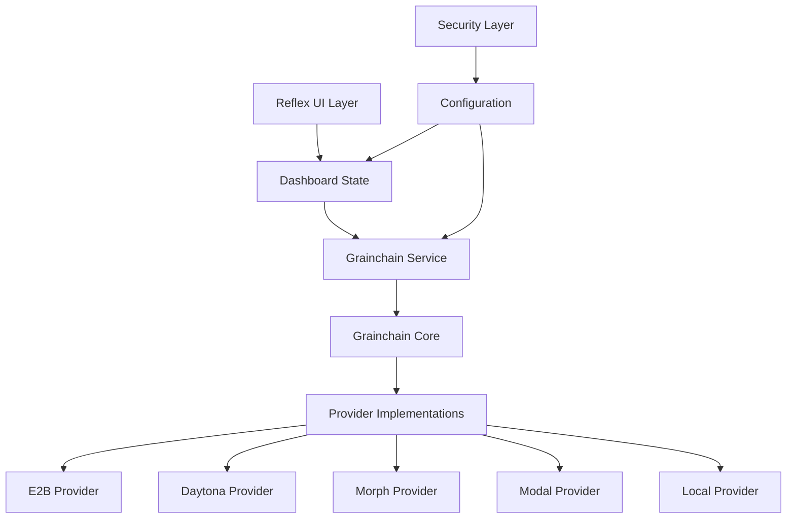

# Grainchain Dashboard Integration Points 🔗

This document outlines all the integration points in the Grainchain Dashboard, providing a comprehensive view of how different components interact with each other and external systems.

## 🏗️ Architecture Overview



## 🔌 Core Integration Points

### 1. **Reflex Framework Integration**
- **Location**: `main.py`, `state.py`
- **Purpose**: Web UI framework and state management
- **Key Components**:
  - `DashboardState`: Central state management
  - `rx.Component`: UI component system
  - Event handling and reactive updates

### 2. **Grainchain Core Integration**
- **Location**: `services/grainchain_service.py`
- **Purpose**: Sandbox provider abstraction
- **Key Interfaces**:
  - `Sandbox`: Core sandbox interface
  - `SandboxConfig`: Configuration management
  - `ExecutionResult`: Command execution results
  - `FileInfo`: File system operations

### 3. **Async-to-Sync Bridge**
- **Location**: `services/grainchain_service.py`
- **Purpose**: Bridge async Grainchain operations with sync Reflex
- **Implementation**: `ThreadPoolExecutor` with event loop management
- **Methods**: `_run_async()` for all async operations

## 🌐 Provider Integration Points

### 1. **E2B Provider**
- **Configuration**: `E2B_API_KEY`, `E2B_TEMPLATE`
- **Dependencies**: `grainchain[e2b]`
- **Features**: Cloud sandboxes, templates, snapshots
- **Integration**: Via Grainchain core interfaces

### 2. **Daytona Provider**
- **Configuration**: `DAYTONA_API_KEY`, `DAYTONA_WORKSPACE_TEMPLATE`
- **Dependencies**: `grainchain[daytona]`
- **Features**: Development workspaces, collaboration
- **Integration**: Via Grainchain core interfaces

### 3. **Morph Provider**
- **Configuration**: `MORPH_API_KEY`, VM specifications
- **Dependencies**: `grainchain[morph]`
- **Features**: Custom VMs, fast snapshots
- **Integration**: Via Grainchain core interfaces

### 4. **Modal Provider**
- **Configuration**: `MODAL_TOKEN_ID`, `MODAL_TOKEN_SECRET`
- **Dependencies**: `grainchain[modal]`
- **Features**: Serverless compute, scaling
- **Integration**: Via Grainchain core interfaces

### 5. **Local Provider**
- **Configuration**: `LOCAL_WORKING_DIR`
- **Dependencies**: None (built-in)
- **Features**: Local development, testing
- **Integration**: Direct subprocess execution

## 🔧 Component Integration Points

### 1. **State Management Integration**
```python
# State flows through all components
DashboardState -> Components -> User Actions -> State Updates
```

### 2. **Provider Settings Integration**
- **Components**: `provider_settings.py`, `provider_selector.py`
- **State**: Provider configurations and health status
- **Security**: Encrypted credential storage

### 3. **Command Terminal Integration**
- **Component**: `command_terminal.py`
- **Service**: Command execution via `grainchain_service`
- **Features**: Real-time output, history, quick commands

### 4. **File Browser Integration**
- **Component**: `file_browser.py`
- **Service**: File operations via `grainchain_service`
- **Features**: Upload, download, directory navigation

### 5. **Snapshot Manager Integration**
- **Component**: `snapshot_manager.py`
- **Service**: Snapshot operations via `grainchain_service`
- **Features**: Create, restore, delete snapshots

## 🔐 Security Integration Points

### 1. **Credential Management**
- **Location**: `config.py`, `security/` (future)
- **Features**: 
  - Environment variable loading
  - Optional encryption for sensitive data
  - Secure API key storage

### 2. **Input Validation**
- **Location**: Throughout components
- **Features**:
  - Command sanitization
  - File path validation
  - Configuration validation

### 3. **Error Handling**
- **Location**: `services/grainchain_service.py`
- **Features**:
  - Exception wrapping
  - User-friendly error messages
  - Logging and monitoring

## 📊 Data Flow Integration Points

### 1. **Configuration Flow**
```
Environment Variables -> Config -> Provider Configs -> Service Layer
```

### 2. **Command Execution Flow**
```
UI Input -> State -> Service -> Grainchain -> Provider -> Results -> UI
```

### 3. **File Operations Flow**
```
UI Action -> State -> Service -> Grainchain -> Provider -> File System
```

### 4. **Snapshot Management Flow**
```
UI Request -> State -> Service -> Grainchain -> Provider -> Storage
```

## 🔄 Event Integration Points

### 1. **UI Events**
- **Triggers**: Button clicks, form submissions, navigation
- **Handlers**: State methods that update application state
- **Propagation**: Automatic UI updates via Reflex reactivity

### 2. **Provider Events**
- **Health Checks**: Periodic provider status updates
- **Connection Events**: Provider availability changes
- **Error Events**: Provider-specific error handling

### 3. **Sandbox Events**
- **Lifecycle**: Creation, running, stopping, cleanup
- **Status Changes**: Real-time status updates
- **Resource Events**: Memory, CPU, disk usage

## 🌍 External Integration Points

### 1. **Web Browser Integration**
- **Interface**: HTTP/WebSocket via Reflex
- **Features**: Real-time updates, responsive design
- **Compatibility**: Modern browsers with JavaScript

### 2. **File System Integration**
- **Local Provider**: Direct file system access
- **Cloud Providers**: Remote file system operations
- **Security**: Path validation and sandboxing

### 3. **Network Integration**
- **Provider APIs**: HTTPS connections to cloud providers
- **Timeouts**: Configurable network timeouts
- **Retry Logic**: Automatic retry for transient failures

## 🔧 Development Integration Points

### 1. **Testing Integration**
- **Framework**: pytest for unit and integration tests
- **Mocking**: Mock provider responses for testing
- **Coverage**: Test coverage for critical paths

### 2. **Logging Integration**
- **Framework**: Python logging module
- **Levels**: Debug, info, warning, error
- **Destinations**: Console, files, external systems

### 3. **Configuration Integration**
- **Environment**: `.env` files for development
- **Validation**: Pydantic models for configuration
- **Defaults**: Sensible defaults for all settings

## 🚀 Deployment Integration Points

### 1. **Container Integration**
- **Docker**: Containerized deployment support
- **Environment**: Environment variable injection
- **Networking**: Port mapping and service discovery

### 2. **Cloud Integration**
- **Platforms**: Support for major cloud platforms
- **Scaling**: Horizontal scaling capabilities
- **Monitoring**: Health checks and metrics

### 3. **CI/CD Integration**
- **Testing**: Automated test execution
- **Building**: Container image building
- **Deployment**: Automated deployment pipelines

## 📈 Monitoring Integration Points

### 1. **Health Monitoring**
- **Providers**: Real-time provider health checks
- **Sandboxes**: Sandbox status monitoring
- **System**: Application health and performance

### 2. **Metrics Integration**
- **Usage**: Sandbox usage statistics
- **Performance**: Response times and throughput
- **Errors**: Error rates and types

### 3. **Alerting Integration**
- **Thresholds**: Configurable alert thresholds
- **Notifications**: Multiple notification channels
- **Escalation**: Alert escalation policies

## 🔮 Future Integration Points

### 1. **API Integration**
- **REST API**: External API for programmatic access
- **Authentication**: API key or OAuth integration
- **Rate Limiting**: Request rate limiting

### 2. **Database Integration**
- **Persistence**: Persistent storage for configurations
- **History**: Command and operation history
- **Analytics**: Usage analytics and reporting

### 3. **Collaboration Integration**
- **Multi-user**: Multiple user support
- **Permissions**: Role-based access control
- **Sharing**: Sandbox and configuration sharing

### 4. **Plugin Integration**
- **Custom Providers**: Plugin system for custom providers
- **Extensions**: UI and functionality extensions
- **Marketplace**: Plugin marketplace integration

## 🛠️ Integration Best Practices

### 1. **Error Handling**
- Always wrap external calls in try-catch blocks
- Provide meaningful error messages to users
- Log errors with sufficient context for debugging

### 2. **Configuration Management**
- Use environment variables for sensitive data
- Provide sensible defaults for all configurations
- Validate configurations at startup

### 3. **State Management**
- Keep state updates atomic and consistent
- Use proper state synchronization for async operations
- Implement proper cleanup for resources

### 4. **Security**
- Never log sensitive information
- Validate all user inputs
- Use secure communication channels

### 5. **Performance**
- Implement proper caching where appropriate
- Use async operations for I/O bound tasks
- Monitor and optimize critical paths

---

This integration points document provides a comprehensive overview of how all components in the Grainchain Dashboard work together to provide a seamless sandbox management experience.

